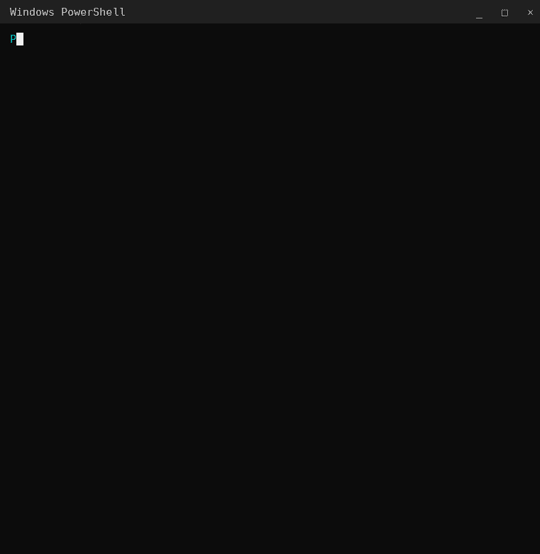
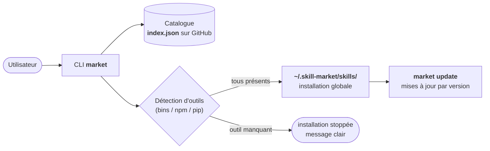
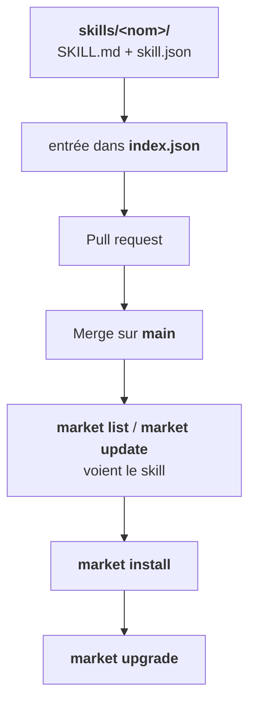

# skill-market

Marketplace de skills pour agents IA. Un catalogue hébergé sur GitHub, un CLI qui installe en global, détecte les outils présents sur la machine et gère les mises à jour.

[](LICENSE)
[](#catalogue)
[](#installer-le-cli)



## Comment ça marche



## Installer le CLI

```bash
curl -sSL https://raw.githubusercontent.com/BlackAngel242/skill-market/main/cli/market -o ~/.local/bin/market
chmod +x ~/.local/bin/market
```

Prérequis : `curl`, `python3`, `git` (recommandé). `~/.local/bin` doit être dans ton `PATH`.

## Installer le CLI (Windows)

Le CLI existe aussi en PowerShell natif (`cli/market.ps1`), sans WSL ni Git Bash :

```powershell
Invoke-WebRequest https://raw.githubusercontent.com/BlackAngel242/skill-market/main/cli/market.ps1 -OutFile market.ps1
powershell -ExecutionPolicy Bypass -File .\market.ps1 install uxfix
```

Toutes les commandes sont identiques : `list`, `search`, `info`, `install`, `upgrade`, `update`, `remove`, `installed`, `publish`.

## Alternative : installer via `npx skills add`

Pas besoin du CLI `market` : le dépôt est compatible avec le gestionnaire de skills de Vercel Labs.

```bash
npx skills add BlackAngel242/skill-market --list          # voir les skills dispo
npx skills add BlackAngel242/skill-market --skill uxfix -g -y   # installer un skill (global)
npx skills add BlackAngel242/skill-market --all -g -y            # tout installer
```

Note : via `npx skills add`, seuls les fichiers du skill sont copiés. La détection et l'installation automatique des outils requis (`skill.json` → `requires`) reste l'exclusivité de `market install`.

## Utilisation

```bash
market list              # catalogue distant
market search design     # recherche
market info uxfix        # fiche détaillée
market install uxfix             # installe en global, détecte/installe les outils requis
market install uxfix -y          # sans demander confirmation
market upgrade uxfix             # met à jour un skill
market update                    # met à jour tout ce qui est installé
market installed                 # ce qui est installé localement
market remove uxfix              # désinstalle
market publish skills/<nom>    # valide un skill avant soumission (PR)
```

Les skills s'installent dans `~/.skill-market/skills/<nom>` (variable `MARKET_HOME` pour changer).

## Détection d'outils

Chaque skill déclare ses prérequis dans `skill.json` :

```json
{
  "name": "uxfix",
  "version": "1.0.0",
  "requires": {
    "bins": ["node"],
    "npm": ["impeccable"],
    "pip": []
  }
}
```

À l'installation, le CLI vérifie chaque entrée :

| Clé | Comportement |
|---|---|
| `bins` | le binaire doit exister sur la machine, sinon l'installation s'arrête avec un message clair |
| `npm` / `pip` | si le paquet manque, le CLI propose de l'installer (avec `-y`, il le fait sans demander) |

## Catalogue

| Skill | Version | Description |
|---|---|---|
| `uxfix` |  | Corrige seul les défauts UI : boucle détecter → corriger → revérifier jusqu'à 99/100 (contrastes, halos, easings, palettes, copy). |
| `prd-table-ronde` |  | Transforme une idée en PRD cadrée via une table ronde d'experts dimensionnée. |
| `smokekit-ai-workflow-orchestration` |  | Orchestration multi-IA auto-évolutive : 20 agents SDLC, router réel avec détection d'outils, boucle d'apprentissage qui ajuste le routing selon tes corrections. |

## Publier un skill



1. Crée `skills/<nom>/` avec au minimum `SKILL.md` (la doc du skill) et `skill.json` (nom, version, description, `requires`).
2. Valide avec `market publish skills/<nom>` : 12 vérifications (frontmatter, JSON, cohérence des noms, version semver, collision dans `index.json`, secrets, taille). La commande affiche l'entrée `index.json` à ajouter si tout passe.
3. Ajoute cette entrée dans `index.json`.
4. Ouvre une pull request. Une fois mergée, `market list` et `market update` voient le skill.

Voir [CONTRIBUTING.md](CONTRIBUTING.md) pour le détail.

## Licence

MIT. Voir [LICENSE](LICENSE).
